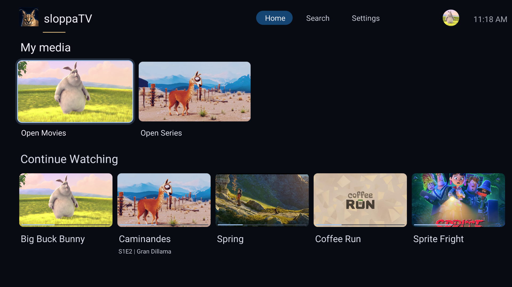
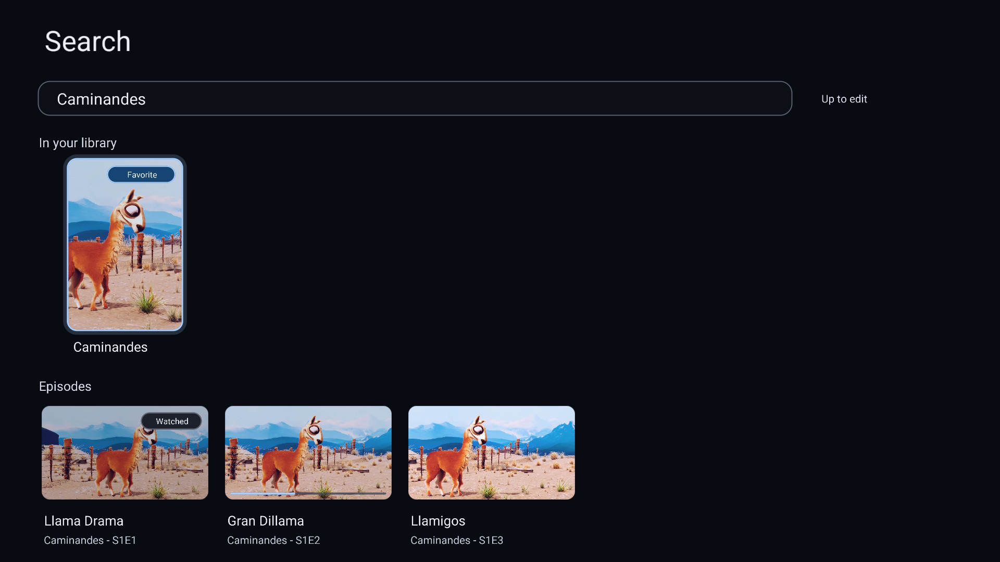
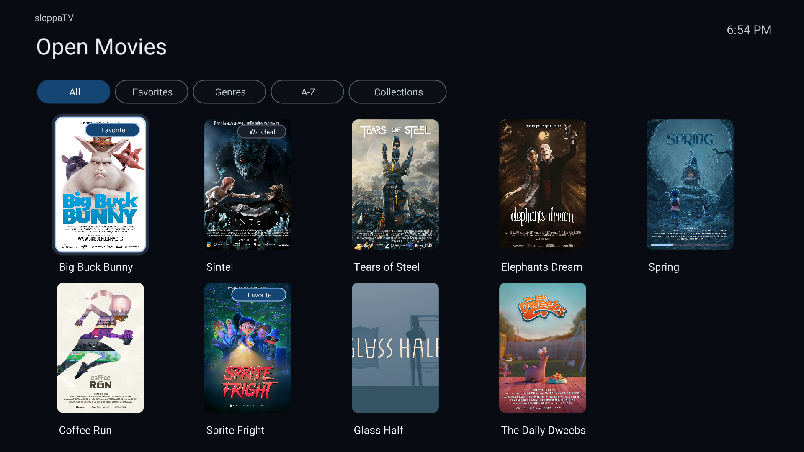
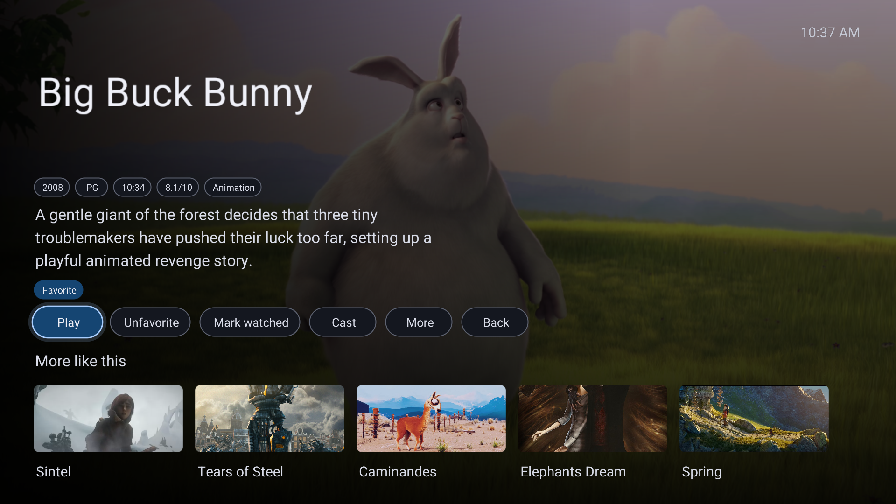
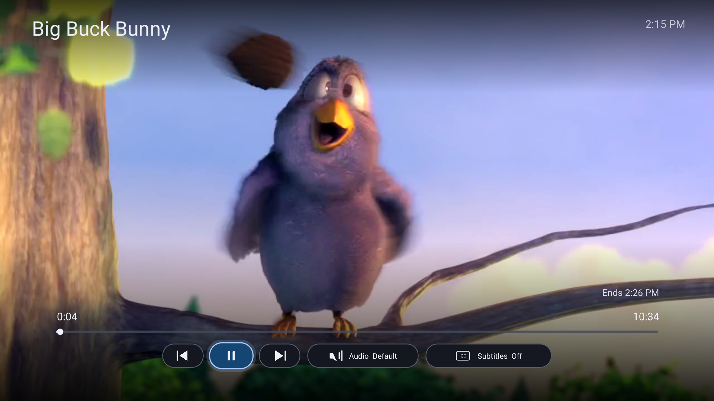
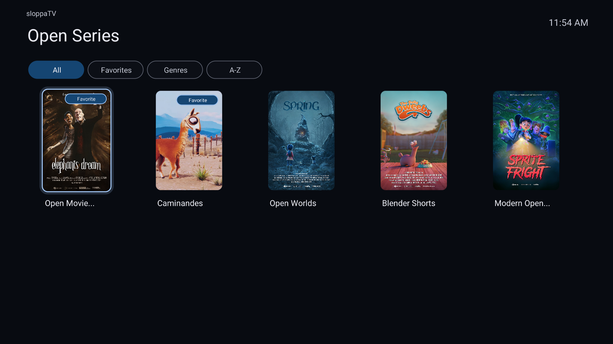
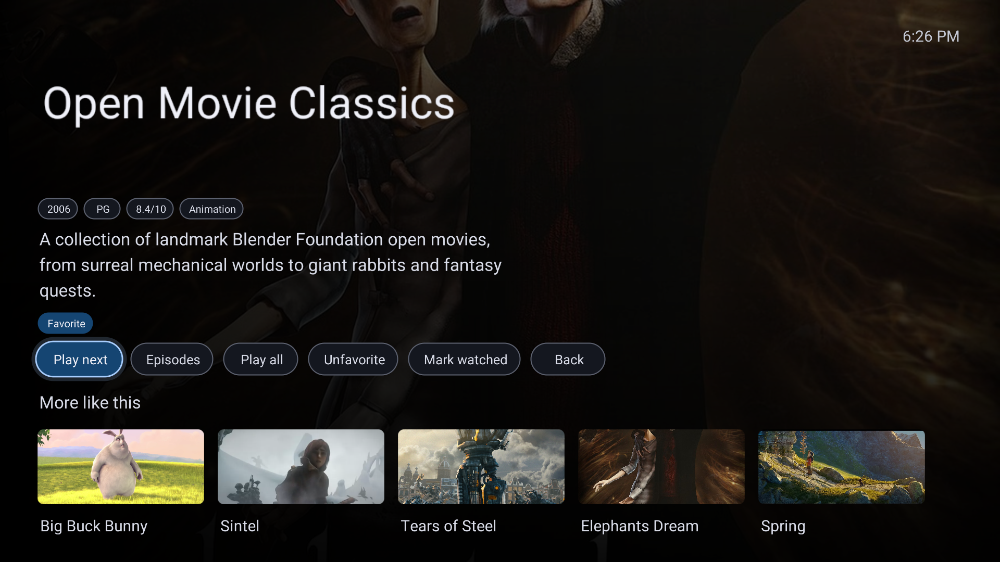
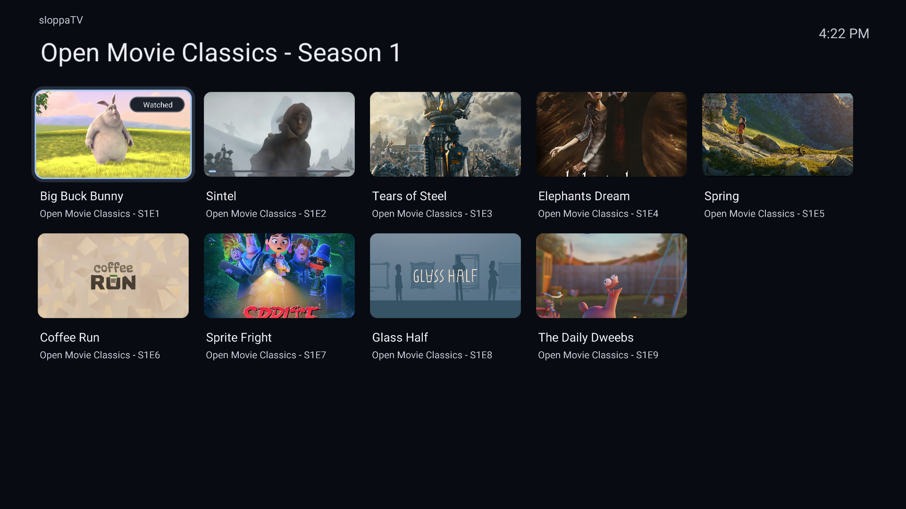

  

  <h1>sloppaTV</h1>

  
A couch-first Jellyfin client for Android TV.

  

    
    
  

## Screenshots

  
   
  
   
  
   
  
   
  
   
  
   
  
   
  

## License

GPL-3.0-or-later. See [LICENSE](LICENSE).
